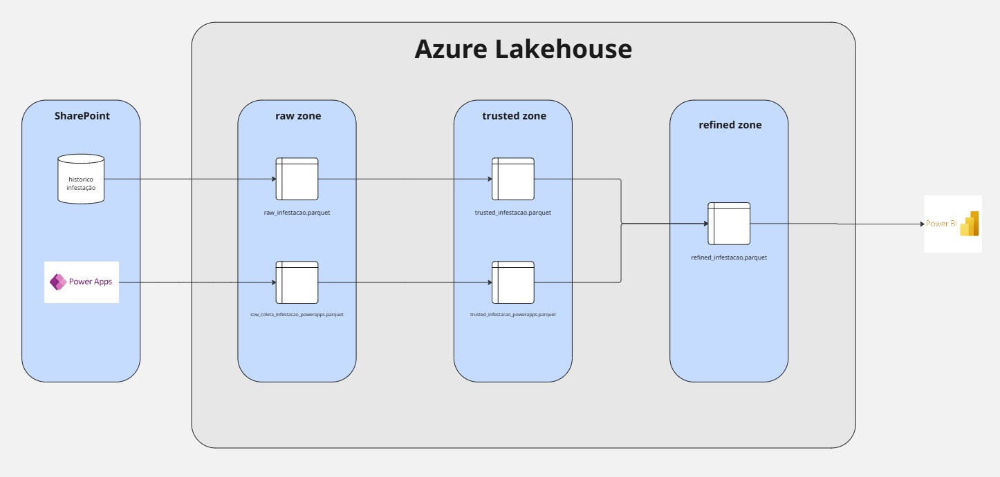
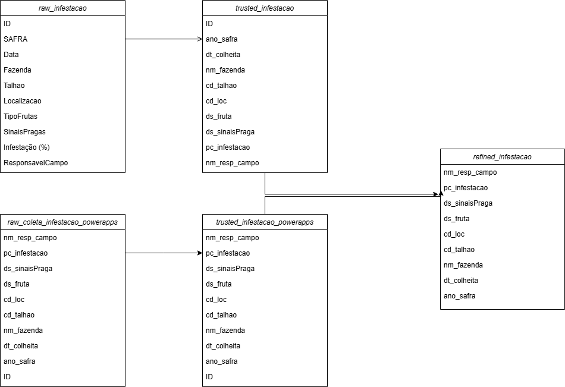

# Documentação Infestação de Pragas 

Essa documentação, tem como objetivo documentar todas as tabelas e a arquitetura aplicada no projeto

## Índice

1. [Arquitetura de dados](#Arquitetura-de-dados)
2. [Schema tabelas](#Schema-tabelas)
3. [Power Apps](#PowerApps)
4. [Funcionalidades](#funcionalidades)

## Arquitetura de dados

## Schema tabelas

## PowerApps

O wireframe do app com o fluxo pode ser visualizado no lingk a seguir

[Figma Wireframe](https://www.figma.com/design/vLTmkGjIb4xna94cbMrHwI/Power-apps?node-id=0-1&t=ZeRoiulVDvvW5Rho-1)

## Catalogo da tabela Refined

| Coluna           | Tipo       | Descrição                               | Transformação                                    | Origem          |
|------------------|-----------|-----------------------------------------|-------------------------------------------------|-------------------|
| ID               | INT       | Identificador único da inspeção         | Gerado/atribuído no sistema                      | ID               |
| ano_safra        | INT       | Ano da safra (ex.: 2025)                | Padronizado, valores fora do range de 1900 a 2100| SAFRA            |
| dt_colheita      | DATE      | Data da colheita                        | Convertido para formato DATE                     | Data             |
| nm_fazenda       | STRING    | Nome da fazenda                         | Uppercase e remoção de caracteres especiais      | Fazenda          |
| cd_talhao        | INT       | Código do talhão                        | Nulos/negativos tratados como inválidos          | Talhao           |
| cd_loc           | STRING    | Localização geográfica                  | Padronizado (sem hífens extras)                  | Localizacao      |
| ds_fruta         | STRING    | Tipo da fruta (ex.: Laranja)            | Padronização de texto                            | TipoFruta        |
| ds_sinaisPraga   | STRING    | Sinais da praga identificada            | Normalização de valores (ex.: "Nenhum")          | SinaisPragas     |
| pc_infestacao    | FLOAT     | Percentual de infestação (%)            | Valores inválidos ajustados                      | Infestação (%)   |
| nm_resp_campo    | STRING    | Nome do responsável pela inspeção       | Padronização de texto                            | ResponsavelCampo |
| dh_insercao      | DATETIME  | Data/hora de inserção no histórico      | Inserido no momento do processamento             | Pipeline ETL     |

